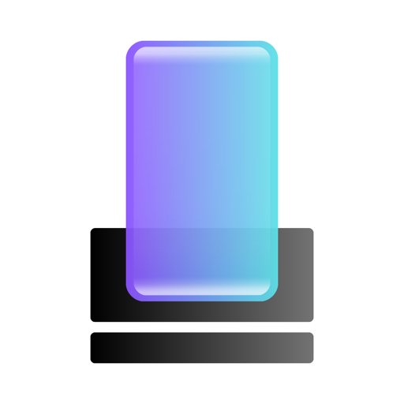
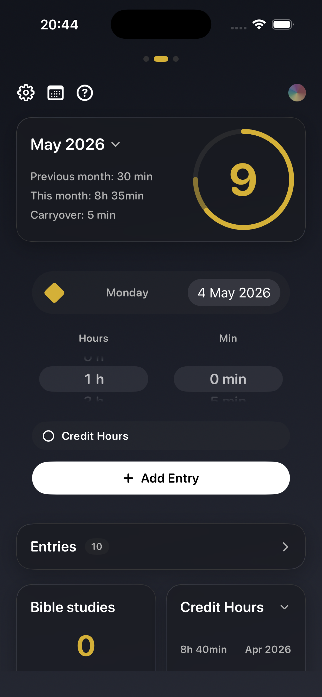
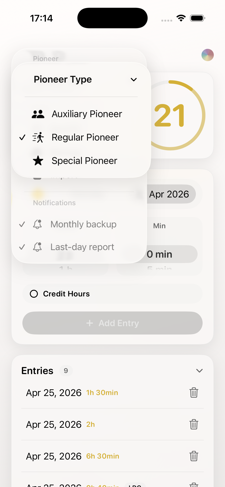
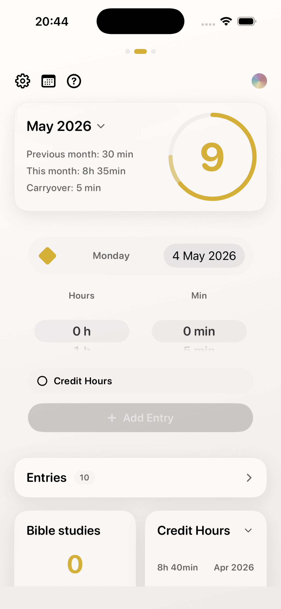
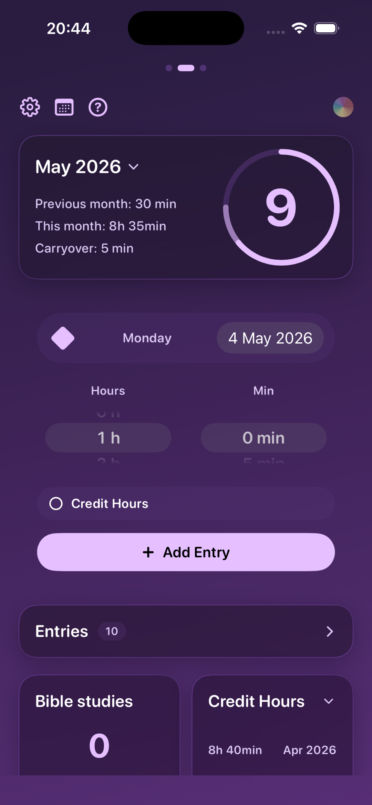
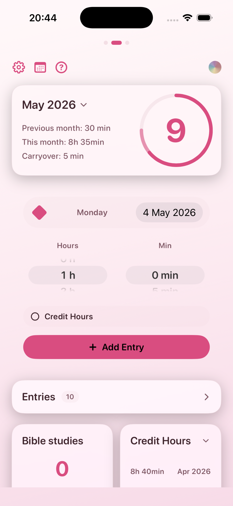
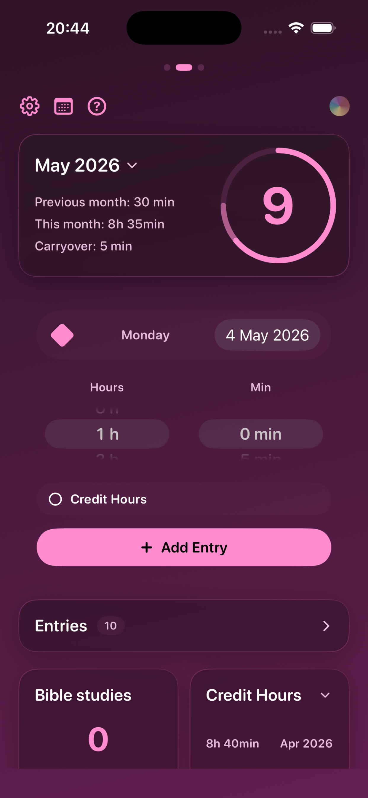

<table>
  <tr>
    <td></td>
    <td><h1>Pioneer Helper</h1></td>
  </tr>
</table>

Pioneer Helper is a clean, focused iOS app for recording field service time, credit hours, Bible studies, monthly reports, and service-year progress in one place.

It supports **Auxiliary**, **Regular**, and **Special Pioneers**, with automatic minute carryover, service-year statistics, iCloud sync, JSON backup/import, reminders, and customizable themes.

---

## Support

If you enjoy the app, consider supporting development:

For support or bug reports, email `phillip.leroy+pioneerhelper@gmail.com`.

---

## Features

- **Daily service records** — Add hours and minutes for any date, then edit or delete records later.
- **Built-in timer** — Track a service session while it is happening, then save the elapsed time as a record for today.
- **Live Activity support** — Keep an active timer visible from supported iOS system surfaces, including Dynamic Island.
- **Monthly report card** — See previous carryover, this month's total, whole report hours, and minutes carried forward.
- **Copyable field service report** — Copy the selected month's report text and paste it wherever you need to send it.
- **Service-year progress** — Track the September-August service year with progress rings, pace guidance, remaining time, and yearly statistics.
- **Pioneer type modes** — Auxiliary, Regular, and Special Pioneer modes adjust the app's targets and credit-hours behavior.
- **Credit hours** — Record LDC, HLC, Bethel, School, and Other credit hours separately from regular field service time.
- **Bible studies** — Set the monthly Bible study count once; the latest count carries forward until changed.
- **Backfill previous months** — Add final totals for months already reported before you started using the app.
- **iCloud sync** — Keep app data available across devices signed in to the same Apple ID when iCloud is enabled.
- **Manual backup and import** — Export a JSON backup and restore records, Bible studies, and app settings later.
- **Reminders** — Enable monthly backup reminders and last-day report reminders.
- **8 themes** — System, White, Dark, Purple, Pink, Magenta, Blue, and Cosmic Orange.
- **4 languages** — English, Portuguese, Dutch, and Spanish.

---

## Screenshots

  
  
  

  
  
  

---

## How The App Works

### 1. Choose your pioneer type

On first launch, choose Auxiliary, Regular, or Special Pioneer. You can change this later in Settings.

| Pioneer type | Yearly target | Monthly pace | Credit hours |
|--------------|---------------|--------------|--------------|
| Auxiliary Pioneer | No yearly target | No pace target | Not shown |
| Regular Pioneer | 600 hours | 50 hours/month | Supported |
| Special Pioneer | 1,200 hours | 100 hours/month | Supported |

### 2. Add time records

Pick the service date, choose hours and minutes, then tap **Add Entry** and confirm with the checkmark. Minutes are entered in 5-minute steps. New records appear at the top of Entries and briefly highlight after saving.

You can also swipe to the Timer page, start a timer, pause when needed, and stop it to save the elapsed time as a record for today.

### 3. Review monthly reports

Pioneer Helper calculates reports by grouping regular service records by month. Reports use whole hours, and leftover minutes carry automatically into the next month.

For example, if one month has 9h 45min, the report shows 9 hours and carries 45 minutes forward. Credit hours are tracked separately and do not affect regular monthly hours, carryover, or service-year progress.

### 4. Track service-year progress

The service year runs from September through August. Regular Pioneers track progress toward 600 hours, and Special Pioneers track progress toward 1,200 hours.

The Statistics page summarizes regular hours, average monthly hours, credit hours when supported, Bible studies, best month, pace, remaining time, and a monthly breakdown with a line graph.

### 5. Record credit hours

Regular and Special Pioneers can turn on **Credit Hours** before saving a record, then choose a category:

- LDC
- HLC
- Bethel
- School
- Other

Credit hours appear in their own card and can be copied as a separate summary.

### 6. Keep Bible study counts

Set the Bible study count for a month. Future months keep using the latest count until you update another month.

### 7. Backfill older months

If you start using Pioneer Helper in the middle of a service year, use **Settings > Data > Backfill** to enter totals for past months. Backfill creates one **Monthly total** entry per month. If a month already has records, the app can skip it or replace that month after confirmation.

### 8. Backup, import, and sync

When iCloud is enabled, Pioneer Helper syncs app data through the user's private iCloud account. The app also keeps an iCloud backup snapshot that can help restore data after reinstalling when local records are empty.

For extra safety, use **Settings > Data > Backup** to export a JSON backup file. Backups include:

- service records
- credit-hour categories
- Bible study counts
- theme selection
- pioneer type
- reminder settings
- entries display preference

Use **Settings > Data > Import** to restore from a backup JSON file. Import adds records and Bible study months that are not already present, then restores saved settings.

---

## Themes

| Theme | Style |
|-------|-------|
| System | Follows device appearance |
| White | Light background with warm accents |
| Dark | Dark background with gold accents |
| Purple | Deep purple gradient |
| Pink | Soft pink light mode |
| Magenta | Rich magenta gradient |
| Blue | Dark navy with blue accents |
| Cosmic Orange | Dark orange cosmic style |

---

## Privacy

Pioneer Helper is designed as a personal, local-first record app.

- Records are stored on your device.
- iCloud sync uses your private iCloud account when enabled.
- Manual backups are JSON files saved wherever you choose.
- The app does not use a custom server for your personal records.

---

## Requirements

- iOS 17.0 or later
- iCloud account for multi-device sync
- Live Activities require a supported iOS version and device surface

---

## License

All rights reserved.
